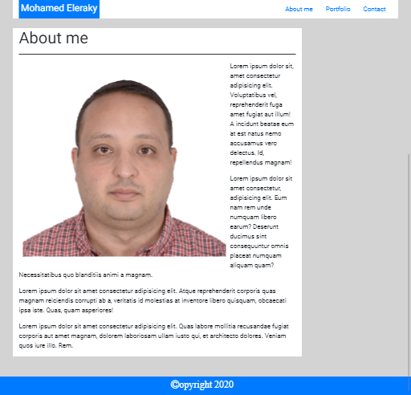
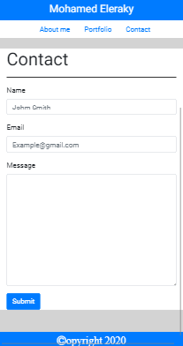

# Responsive Portfolio

## Description

The aim of this project is to build a responsive portfolio website with three pages (About, Projects and Contact pages). The website needs to be responsive and display differently according to the device screen size.

[Click here to the view the website on github-pages](https://mohamedzakigithub.github.io/homework-week2-responsive-portfolio/)

## Table of Contents

- [Responsive behavior on different devices](#Responsive%20behavior%20on%20different%20devices)
- [Responsive design implantation](#Responsive%20design%20implantation)
- [Use of media queries](#Use%20of%20media%20queries)
- [Code highlights](#Code%20highlights)

## Responsive behavior on different devices

### Desktop 19 in. (1440px).


### Laptop 13 in. (1024px).




### Tablet (768px).


### Mobile phone (414px).




## Responsive design implantation

Responsive design was implemented by using bootstrap built in grid system which is responsive by default and some custom css styling with media queries. Bootstrap grid system was implemented by deviding the page into rows and columns by applying bootstrap classes and wrapping all the contents in a div with a container class. The container resizes on breakpoints and transform the columns from side by side to top down on smaller screens to ensure that the content is easily read on small devices.

Images on the pages were made responsive as well by using bootstrap built in support for responsive images. this ensures that the images resize as required on smaller or bigger screens

Another requirement was to transform the navbar into two rows on small screens. This was done by using flex-box properties and media query to wrap the nav menu and the navbar brand into separate rows on small screen. The navbar brand is resized to be full width and paddings are removed from the container.

Media query was used to apply some css properties on extra small and small screens ( smaller than 768px ) which covers all mobile phones as they all fall under this category. some applied properties include removing the padding and the margin for the navbar, changing the flex direction of the navbar to column instead of rows and remove the padding from the navbar column to display the navbar brand as full width.

```
@media only screen and (max-width: 768px) {
  .navbar {
    padding: 0px;
    margin: 0px;
    flex-direction: column;
  }

  .navbar-brand {
    width: 100%;
  }

  .nav {
    width: 100%;
    display: flex;
    justify-content: center;
  }

  .col {
    padding: 0px;
  }
}

```

### Code highlights

### HTML

Bootstrap Navbar with brand and nav list

```
<nav class="navbar py-0">
  <div
    class="navbar-brand bg-primary"
    style="text-align: center; padding: 5px;"
  >
    <h4>Mohamed Eleraky</h4>
  </div>
  <ul class="nav">
    <li class="nav-item">
      <a class="nav-link" href="index.html">About me</a>
    </li>
    <li class="nav-item">
      <a class="nav-link" href="portfolio.html">Portfolio</a>
    </li>
    <li class="nav-item">
      <a class="nav-link" href="contact.html">Contact</a>
    </li>
  </ul>
</nav>

```

responsive image

```

```

### CSS

change font family using google fonts library on body element

```
body {
  font-family: "Roboto", sans-serif;
  background-color: lightgray;
}
```

set all columns background to white

```
[class*="col"] {
  background-color: white;
}
```

style horizontal rule

```
hr {
  border: none;
  height: 2px;
  color: #333;
  background-color: #333;
}
```
